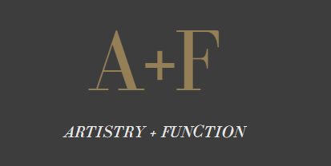
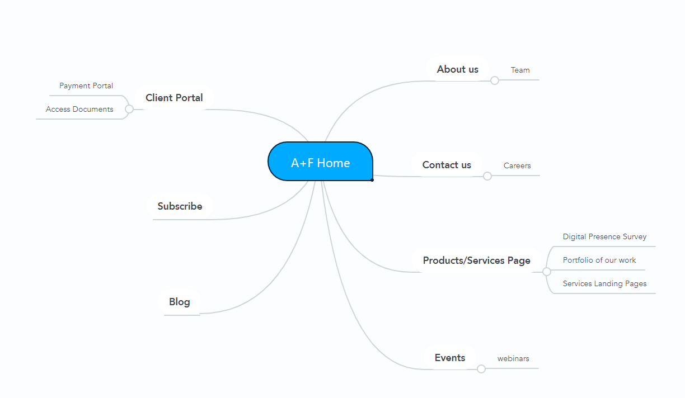

# Artistry + Function

[](https://artistryandfunction.com)
## Deployment
 ### Live Site
 https://artistryandfunction.com


## Introduction
Artistry + Function creates and/or optimize web experiences for business owners, allowing them to realize additional revenue through selling products/services and generating passive income through affiliate marketing connections.  The artistryandfunction.com website will serve as the primary gateway for client acquisition and will serve as the client portal to their account information throughout our relationship. 


## Features and Functionality
```python
* HTML5
* CSS / Bootstrap
* WordPress
* PHP
* React

```

## Site structure
[


#### Collaborators: 
* [LaMana Donadelle](https://www.linkedin.com/in/lamana-donadelle-83b470/) | UX Designer
* [Khayyam Abdullah](https://www.linkedin.com/in/khayyam-abdullah-97a55323/) | Backend Developer 
  
